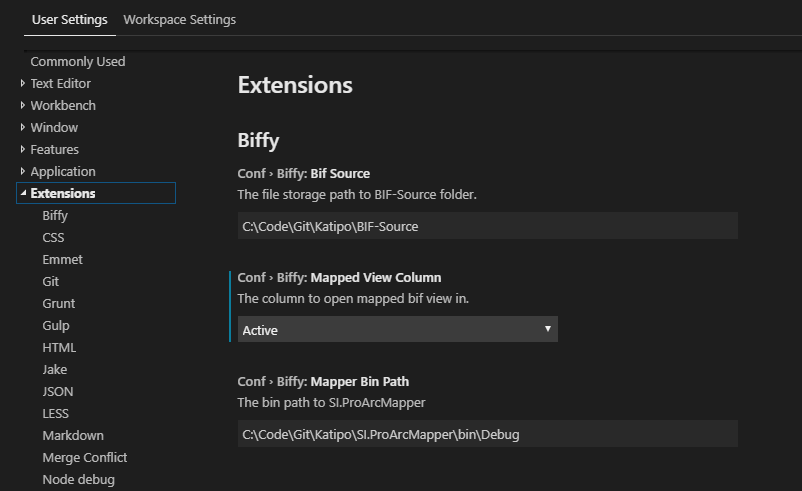
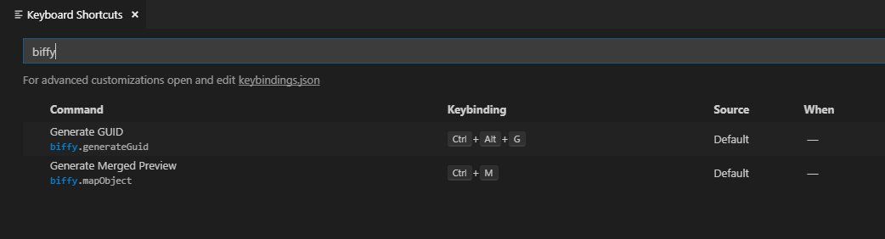

# README

This is the repository for VS Code extension for BIF.

## Features

* Format Document (`Shift + Alt + F`)
* Format Selection (`Ctrl + K Ctrl + F`)
* Find all references (`Shift + Alt + F12`)
* Peek references (`Shift + F12`)
* Go to Definition (`F12`)
* Peek Definition (`Alt + F12`)
* Map current view (`Ctrl + M`)
* Syntax highlighting 
* Block commenting (`Ctrl + K + C` and `Ctrl + K + U`)
* Snippet completion

## Configuration

### Settings
Before using the extension, it is recommended to set up the following
Go to `File > Preferences > Settings` and in the settings for Biffy configure these values
* conf.biffy.bifSource - The path to BIF Source.
In case the configuration is empty, the current workspace root folder is used to find the required references.
> eg C:\Code\Git\Katipo\BIF-Source
* conf.biffy.mapperBinPath - The path to the bin > Debug/Release folder of SI.ProArcMapper project. In case the configuration is empty, it will not be possible to perform on-the-fly mapping of BIF views
> eg C:\Code\Git\Katipo\SI.ProArcMapper\bin\Debug
* conf.biffy.mappedViewColumn - Selecting *Active* opens the mapped view in the same editor window as the current one. Selecting *Beside* opens the mapped view in the editor column next to the active window.

### Key Bindings
* biffy.mapObject - Generates a merged preview of the current active document.
Default is `Ctrl + M`
* biffy.generateGuid - Generate GUIDs.
Default us `Ctrl + Alt + G`

## Setup - Development

1. Open the [source](https://github.com/spoon611/Biffy) in VS Code.
2. Run `npm install`
3. Press `F5` or `Debug > Start debugging`
4. Open the BIF-Source in the newly opened instance of vscode

> Ensure typescript is installed in global scope. Else run >  `npm install -g typescript`

## Requirements

VS Code version should be higher than 1.30.0

## Known Issues

Check out [existing issues](https://github.com/spoon611/Biffy/issues) in the repository.

-----------------------------------------------------------------------------------------------------------

